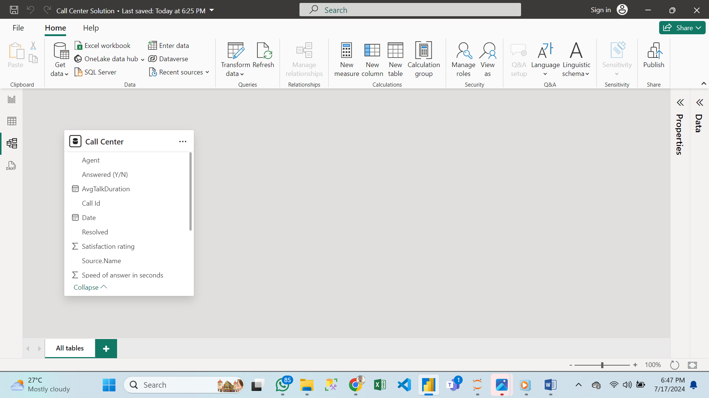
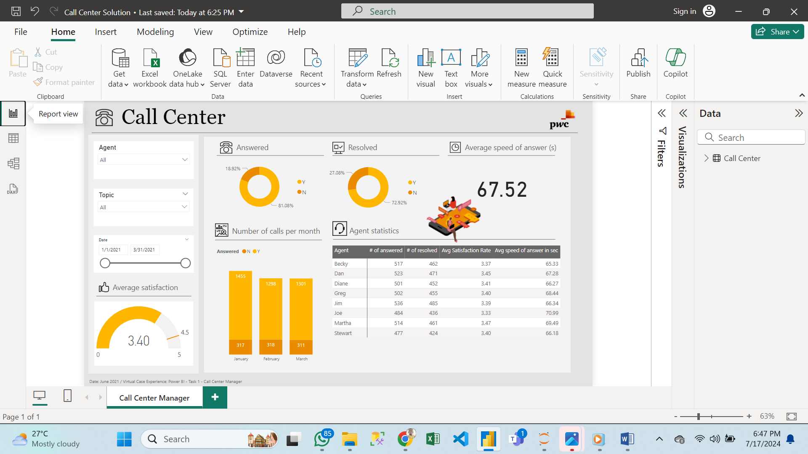

# Call Center Analysis

## Introduction 
The project is on a call center analysis. The project is on the use of Microsoft PowerBI to analyze and visualize reports for Data Driven Decisions. 

## Problem Statement
This project aims to uncover trends within the company's dataset to assist management in making data-driven decisions. The specific problems addressed by this project are:
1.	__Total Number of Calls Answered/Abandoned:__ Determine the total count of answered and abandoned calls to understand call center performance and customer engagement levels.
2.	__Speed of Answer:__ Analyze the average time taken to answer calls, providing insights into the efficiency of the call center's response times.
3.	__Length of Calls:__ Examine the duration of calls to assess the average call length and identify any patterns related to longer or shorter calls.
4.	__Overall Customer Satisfaction:__ Evaluate customer satisfaction levels based on call center interactions to measure the effectiveness of customer service and identify areas for improvement.

## Skills Demonstrated:
In this project, the following skills were showcased through the proficient use of Power BI:
1.	__Data Cleaning:__ Ensuring the dataset is accurate, consistent, and ready for analysis.
2.	__Creation of KPIs and Visualization:__ Developing key performance indicators and visualizations to present data insights effectively.

## Data Sourcing
The data for this project was provided by PwC through Forage for the virtual internship program.

## Data Transformation
The data was transformed using Power Query to ensure it is complete, accurate, and ready for analysis and visualization. This process involved cleaning, filtering, and organizing the data to maintain its integrity and relevance for the project's objectives.

## Modeling
There was no data modeling required for this project as the data was contained in a single table, which simplified the analysis and visualization process.

## Analysis & Visualiztion 
From the analysis, 81.08% of calls were answered, with 72.92% of those answered calls resolved. January emerged as the month with the highest number of calls. For a detailed view, please refer to the dashboard image provided below.

## Recommendation 
50% increase in the number of agents, thereby improving call response times
